# PanRAG - Agentic RAG System

An **Agentic Retrieval-Augmented Generation (RAG) System** that uses multiple specialized agents to improve the quality and accuracy of responses. The system includes:

-   **Router Agent**: Decides whether document retrieval is needed and dynamically adjusts parameters
-   **Retriever Agent**: Retrieves relevant documents with conditional reranking and graph expansion
-   **Answer Agent**: Generates contextualized responses using different prompts based on domain
-   **Verifier Agent**: Validates that responses are grounded in the retrieved context

## Key Features

### 🧠 Agentic Architecture

-   **Intelligent Router** that evaluates retrieval confidence and adjusts parameters
-   **Conditional Reranking** based on confidence thresholds
-   **Automatic Verification** of responses with coverage and diversity metrics
-   **Adaptive Retrieval** with context expansion when needed

### 💬 Ephemeral Conversation Memory

-   **Per-conversation memory** backed by Redis (ephemeral buffer) with a **durable NDJSON log** in MinIO/S3
-   Frontend persists a `conv_id` in localStorage; the backend uses it to fetch and append turns
-   Optional S3→Redis backfill on first access so prior-day turns remain available

### 🔍 Advanced Retrieval

-   Intelligent chunking with `RecursiveCharacterTextSplitter` (size 800, overlap 120)
-   Embeddings and chat via LM Studio endpoint compatible with OpenAI
-   Vector store: Qdrant (local via Docker)
-   Optional graph expansion in Neo4j (NEXT relationships for continuity)
-   Incremental/idempotent ingestion using deterministic `chunk_id`

### 📊 Observability and Logging

-   Structured JSONL logging with latencies and selection metadata
-   Complete traceability with unique `trace_id` per query
-   Verification metrics: citation coverage, evidence diversity
-   Event logging at each pipeline stage

## System Architecture

```
User → Router Agent → [Need docs?] → Retriever Agent → Answer Agent → Verifier Agent
            ↓                            ↓              ↓              ↓
       Decisions                     Documents     Response      Validation
       (confidence, k)              + reranking   contextual   + metrics
```

## Ephemeral Conversation Memory (Redis + MinIO)

### Overview

-   The server maintains a short window of conversation history per `conv_id` in Redis and writes every turn to an NDJSON object per day in MinIO/S3.
-   Agents do not talk to Redis/S3 directly. The server reads history from Redis and passes it to `AnswerAgent`, which uses up to `ANSWER_HISTORY_TURNS` turns.

### Flow

```mermaid
sequenceDiagram
    autonumber
    participant UI as Web UI (conv_id in localStorage)
    participant API as FastAPI /query
    participant MEM as EphemeralMemory
    participant REDIS as Redis (buffer)
    participant S3 as MinIO/S3 (NDJSON log)

    UI->>API: POST /query {question, conv_id}
    API->>MEM: ensure_backfill(conv_id)
    MEM->>REDIS: LLEN buffer:<conv_id>
    alt empty buffer and S3 enabled
        MEM->>S3: get memlog/<conv_id>/YYYY-MM-DD.ndjson (± previous days)
        MEM->>REDIS: RPUSH last N turns + EXPIRE
    end
    API->>MEM: get_buffer(conv_id)
    MEM->>REDIS: LRANGE buffer:<conv_id>
    API->>API: AnswerAgent.run(..., conversation_history)
    API->>MEM: append_turn(conv_id, role="user"|"assistant", text, meta)
    MEM->>REDIS: RPUSH + LTRIM + EXPIRE
    MEM->>S3: PUT memlog/<conv_id>/YYYY-MM-DD.ndjson (append line)
```



### Data layout

-   Redis keys:
    -   `buffer:<conv_id>`: list of JSON turns, capped to `REDIS_BUFFER_MAX_TURNS`, TTL `REDIS_TTL_HOURS`
    -   `buffer:<conv_id>:seq`: integer sequence counter
-   S3 objects:
    -   `S3_MEMLOG_PREFIX/<conv_id>/YYYY-MM-DD.ndjson`
    -   Each line is one JSON turn

### Frontend behavior

-   The UI keeps a `conv_id` in `localStorage` and sends it on every request.
-   Clicking “Nueva conversación” clears `conv_id` and starts a fresh history.

### Configuration (.env)

```env
# ===== EPHEMERAL MEMORY: REDIS =====
REDIS_ENABLED=true
# If running server on host and Redis via docker with exposed port
REDIS_URL=redis://localhost:6379/0
# Or, if server runs in the same docker compose network
# REDIS_URL=redis://redis:6379/0
REDIS_TTL_HOURS=72
REDIS_BUFFER_MAX_TURNS=12

# ===== DURABLE LOG: MINIO / S3 =====
S3_ENABLED=true
S3_ENDPOINT=http://localhost:9000
S3_ACCESS_KEY=minio
S3_SECRET_KEY=minio12345
S3_SECURE=false
S3_BUCKET=memlog
S3_MEMLOG_PREFIX=memlog
S3_BACKFILL_MAX_LINES=200

# ===== ANSWER HISTORY USAGE =====
ANSWER_USE_HISTORY=true
ANSWER_HISTORY_TURNS=6
```

### Docker (Redis and MinIO)

If you run FastAPI on the host, expose Redis from docker:

```yaml
services:
    redis:
        image: redis:7-alpine
        ports:
            - '6379:6379'
```

MinIO requires a bucket; create it once:

```bash
docker exec agentic-rag-poc-minio-1 mc alias set local http://localhost:9000 minio minio12345
docker exec agentic-rag-poc-minio-1 mc mb local/memlog
docker exec agentic-rag-poc-minio-1 mc version enable local/memlog
```

### Observability

-   The server logs structured events to `logs/rag.log`:

```json
{"event":"mem.init","redis_connected":true,"s3_ready":true,"s3_bucket":"memlog"}
{"event":"mem.history.read","conv_id":"...","count":1}
{"event":"mem.history.used","conv_id":"...","turns_used":1}
{"event":"mem.redis.append","conv_id":"...","role":"user","seq":2}
{"event":"mem.s3.append","conv_id":"...","object":"memlog/.../2025-08-17.ndjson","bytes":1234}
```

### Verify it works

-   Send two messages without resetting the chat (same `conv_id`). On the second message you should see `history_turns_used > 0` in the UI and the events above in the log.
-   Redis (inside container):

```bash
docker exec redis redis-cli LLEN buffer:<conv_id>
docker exec redis redis-cli LRANGE buffer:<conv_id> 0 -1
```

-   MinIO:

```bash
docker exec agentic-rag-poc-minio-1 mc ls -r local/memlog
docker exec agentic-rag-poc-minio-1 mc cat local/memlog/<conv_id>/$(date -u +%F).ndjson
```

### Troubleshooting (memory)

-   `history_turns_used` is 0 on second turn → check `REDIS_ENABLED`, port exposure, and `mem.history.read` count in logs.
-   No NDJSON objects in MinIO → confirm `S3_ENABLED=true`, `S3_BUCKET` set and exists, and look for `mem.s3.append` or `mem.s3.append.error` with details.

### Detailed Agentic RAG Flow

```
┌─────────────────────────────────────────────────────────────────────────────────┐
│                                USER QUERY                                      │
│                              "How to install X?"                               │
│                      conv_id from UI (localStorage)                             │
└─────────────────────┬───────────────────────────────────────────────────────────┘
                      │
                      ▼
┌─────────────────────────────────────────────────────────────────────────────────┐
│                    SERVER (Conversation Memory Handling)                        │
│  1) ensure_backfill(conv_id): if Redis empty → read recent NDJSON from S3       │
│  2) get_buffer(conv_id): read history window from Redis                         │
│  3) pass conversation_history to AgenticRAG                                     │
└─────────────────────┬───────────────────────────────────────────────────────────┘
                      │
                      ▼
┌─────────────────────────────────────────────────────────────────────────────────┐
│                              ROUTER AGENT                                     │
│  ┌─────────────────────────────────────────────────────────────────────────┐   │
│  │ 1. Language Detection: "en"                                            │   │
│  │ 2. Intent Classification: "task"                                        │   │
│  │ 3. Confidence Evaluation:                                               │   │
│  │    - Top score: 0.72                                                    │   │
│  │    - Margin: 0.15                                                       │   │
│  │    - Confidence: 0.68                                                   │   │
│  │ 4. Decision: NEED_RETRIEVAL=true, k=12                                 │   │
│  └─────────────────────────────────────────────────────────────────────────┘   │
└─────────────────────┬───────────────────────────────────────────────────────────┘
                      │
                      ▼
┌─────────────────────────────────────────────────────────────────────────────────┐
│                            RETRIEVER AGENT                                    │
│  ┌─────────────────────────────────────────────────────────────────────────┐   │
│  │ 1. Vector Search (k=12)                                                │   │
│  │ 2. Confidence Check: 0.68 < 0.70 → Enable Reranking                    │   │
│  │ 3. Cross-encoder Reranking                                             │   │
│  │ 4. Graph Expansion (if enabled)                                        │   │
│  │ 5. Document Deduplication                                              │   │
│  │ 6. Final Selection: 8 relevant docs                                    │   │
│  └─────────────────────────────────────────────────────────────────────────┘   │
└─────────────────────┬───────────────────────────────────────────────────────────┘
                      │
                      ▼
┌─────────────────────────────────────────────────────────────────────────────────┐
│                              ANSWER AGENT                                     │
│  ┌─────────────────────────────────────────────────────────────────────────┐   │
│  │ 1. Domain Detection: "technical"                                        │   │
│  │ 2. Prompt Selection: Technical system prompt                            │   │
│  │ 3. Context Assembly: 8 docs + metadata                                 │   │
│  │ 4. Uses up to ANSWER_HISTORY_TURNS from conversation_history            │   │
│  │ 5. Generation: Temperature=0.1, MaxTokens=512                          │   │
│  │ 6. Response: "To install X, follow these steps..."                     │   │
│  └─────────────────────────────────────────────────────────────────────────┘   │
└─────────────────────┬───────────────────────────────────────────────────────────┘
                      │
                      ▼
┌─────────────────────────────────────────────────────────────────────────────────┐
│                    SERVER (Persist Conversation Turns)                          │
│  • Append to Redis: RPUSH buffer:<conv_id> + LTRIM + EXPIRE                     │
│  • Append to S3:   memlog/<conv_id>/YYYY-MM-DD.ndjson (one line per turn)       │
└─────────────────────┬───────────────────────────────────────────────────────────┘
                      │
                      ▼
┌─────────────────────────────────────────────────────────────────────────────────┐
│                              VERIFIER AGENT                                   │
│  ┌─────────────────────────────────────────────────────────────────────────┐   │
│  │ 1. Claim Extraction: 3 claims identified                               │   │
│  │ 2. Citation Mapping: 2/3 claims supported                              │   │
│  │ 3. Coverage Calculation: 66.7%                                          │   │
│  │ 4. Policy Check: 66.7% < 90% → FAIL                                    │   │
│  │ 5. Recovery: Expand retrieval with synonyms                             │   │
│  └─────────────────────────────────────────────────────────────────────────┘   │
└─────────────────────┬───────────────────────────────────────────────────────────┘
                      │
                      ▼
┌─────────────────────────────────────────────────────────────────────────────────┐
│                              FINAL RESPONSE                                   │
│  "I couldn't find grounded evidence for exact commands in the current        │
│   context. Here are high-level steps you can follow. If you want, I can      │
│   expand the search to related notes."                                      │
└─────────────────────────────────────────────────────────────────────────────────┘
```

### Router Decision Matrix

```
┌─────────────────────────────────────────────────────────────────────────────────┐
│                              ROUTER DECISION MATRIX                           │
├─────────────────────────────────────────────────────────────────────────────────┤
│ Query Type        │ Confidence │ Margin    │ Decision        │ k    │ Reranking │
├───────────────────┼────────────┼───────────┼─────────────────┼──────┼───────────┤
│ Chitchat          │ N/A        │ N/A       │ NO_RETRIEVAL    │ 0    │ No        │
│ High Confidence   │ ≥0.70      │ ≥0.10     │ RETRIEVAL       │ 6    │ No        │
│ Medium Confidence │ 0.40-0.69  │ 0.05-0.09 │ RETRIEVAL       │ 12   │ Maybe     │
│ Low Confidence    │ <0.40      │ <0.05     │ RETRIEVAL       │ 20   │ Yes       │
│ Language Mismatch │ Any        │ Any       │ RETRIEVAL       │ 20   │ Yes       │
└─────────────────────────────────────────────────────────────────────────────────┘
```

### Agent Interaction Patterns

```
┌─────────────────────────────────────────────────────────────────────────────────┐
│                              AGENT INTERACTIONS                               │
├─────────────────────────────────────────────────────────────────────────────────┤
│                                                                                 │
│  ┌─────────────┐    ┌─────────────┐    ┌─────────────┐    ┌─────────────┐     │
│  │   Router    │───▶│  Retriever  │───▶│   Answer    │───▶│  Verifier   │     │
│  │             │    │             │    │             │    │             │     │
│  │ • Confidence│    │ • Vector    │    │ • Domain    │    │ • Claims    │     │
│  │ • Language  │    │ • Rerank    │    │ • Prompts   │    │ • Coverage  │     │
│  │ • Intent    │    │ • Graph     │    │ • Generate  │    │ • Policy    │     │
│  │ • k value   │    │ • Dedupe    │    │ • Context   │    │ • Recovery  │     │
│  └─────────────┘    └─────────────┘    └─────────────┘    └─────────────┘     │
│         │                   │                   │                   │         │
│         ▼                   ▼                   ▼                   ▼         │
│  ┌─────────────┐    ┌─────────────┐    ┌─────────────┐    ┌─────────────┐     │
│  │  Decision   │    │  Documents  │    │  Response   │    │ Validation  │     │
│  │  Metadata   │    │  + Scores   │    │  + Context  │    │  + Metrics  │     │
│  └─────────────┘    └─────────────┘    └─────────────┘    └─────────────┘     │
│                                                                                 │
└─────────────────────────────────────────────────────────────────────────────────┘
```

### Recovery and Fallback Mechanisms

```
┌─────────────────────────────────────────────────────────────────────────────────┐
│                              RECOVERY FLOW                                    │
├─────────────────────────────────────────────────────────────────────────────────┤
│                                                                                 │
│  ┌─────────────┐    ┌─────────────┐    ┌─────────────┐                        │
│  │ Verification│───▶│   FAILED    │───▶│  Recovery   │                        │
│  │   Failed    │    │   Policy    │    │  Attempt    │                        │
│  └─────────────┘    └─────────────┘    └─────────────┘                        │
│         │                   │                   │                              │
│         ▼                   ▼                   ▼                              │
│  ┌─────────────┐    ┌─────────────┐    ┌─────────────┐                        │
│  │ Low Coverage│    │ <90% Claims │    │ 1. Expand k │                        │
│  │ Poor Quality│    │ Unsupported │    │ 2. Synonyms  │                        │
│  │ No Evidence │    │ No Citations│    │ 3. Rerank    │                        │
│  └─────────────┘    └─────────────┘    └─────────────┘                        │
│         │                   │                   │                              │
│         ▼                   ▼                   ▼                              │
│  ┌─────────────┐    ┌─────────────┐    ┌─────────────┐                        │
│  │   Retry     │───▶│  New Docs   │───▶│  Re-verify  │                        │
│  │ Retrieval   │    │  Retrieved  │    │  Response   │                        │
│  └─────────────┘    └─────────────┘    └─────────────┘                        │
│         │                   │                   │                              │
│         ▼                   ▼                   ▼                              │
│  ┌─────────────┐    ┌─────────────┐    ┌─────────────┐                        │
│  │  Success    │    │  Degraded   │    │  Fallback   │                        │
│  │  Response   │    │  Response   │    │  Message    │                        │
│  └─────────────┘    └─────────────┘    └─────────────┘                        │
│                                                                                 │
└─────────────────────────────────────────────────────────────────────────────────┘
```

### Specialized Agents

1. **Router Agent** (`panrag/agents/router.py`)

    - Evaluates whether retrieval is needed based on similarity confidence
    - Dynamically adjusts the number of documents to retrieve (k)
    - Detects language and adjusts retrieval parameters
    - Identifies chitchat vs. task queries

2. **Retriever Agent** (`panrag/agents/retriever.py`)

    - Retrieves documents by vector similarity
    - Applies conditional reranking when confidence is low
    - Expands context using Neo4j graph relationships (optional)
    - Deduplicates documents and maintains ranking

3. **Answer Agent** (`panrag/agents/answer.py`)

    - Generates responses using domain-specific prompts
    - Adjusts parameters based on query type (chitchat vs. task)
    - Includes source citations in context

4. **Verifier Agent** (`panrag/agents/verifier.py`)
    - Validates that responses are grounded in context
    - Calculates citation coverage metrics
    - Applies configurable verification policies
    - Allows expanded retrieval if verification fails

## Project Structure

```
panrag/
├── __init__.py          # Factory function to build the system
├── agent.py             # Main AgenticRAG class
├── agents/              # Specialized agents
│   ├── __init__.py
│   ├── router.py        # Router Agent
│   ├── retriever.py     # Retriever Agent
│   ├── answer.py        # Answer Agent
│   └── verifier.py      # Verifier Agent
├── config.py            # Centralized configuration
├── embeddings.py        # LM Studio embeddings client
├── graph_utils.py       # Neo4j graph utilities
├── logging_utils.py     # Logging utilities
└── prompts.py           # System prompts

ingest.py                # Document ingestion script
server.py                # FastAPI server with frontend
static/index.html        # ChatGPT-style web UI
```

## Requirements

-   Python 3.10+
-   LM Studio (or OpenAI-compatible server) listening at `LMSTUDIO_BASE`
-   Docker (for Qdrant and optionally Neo4j)

Recommended to use a virtual environment:

```bash
python -m venv .venv
source .venv/bin/activate  # Windows: .venv\Scripts\activate
```

Install Python dependencies:

```bash
# Manual installation
# For Windows:
pip install -r requirements.txt

# For Linux/Mac (with uvloop for better performance):
pip install -r requirements-posix.txt
```

## Environment Variables (.env)

```env
# ===== ENDPOINTS AND MODELS =====
# LM Studio / OpenAI-compatible endpoints
LMSTUDIO_BASE=http://localhost:1234/v1
LMSTUDIO_API_KEY=lm-studio
LMSTUDIO_EMBED_MODEL=nomic-ai/nomic-embed-text-v1.5
LMSTUDIO_CHAT_MODEL=gpt-oss-20b

# ===== QDRANT VECTOR STORE =====
QDRANT_URL=http://localhost:6333
QDRANT_COLLECTION=docs
QDRANT_API_KEY=                    # leave empty for local HTTP
QDRANT_BATCH_SIZE=256              # batch size for ingestion

# ===== NEO4J GRAPH (OPTIONAL) =====
GRAPH_ENABLED=false                 # enable graph expansion
NEO4J_URI=neo4j://localhost:7687
NEO4J_USER=neo4j
NEO4J_PASSWORD=neo4j_password

# ===== LOGGING AND VERSIONING =====
RAG_INDEX_VERSION=v1
RAG_LOG_PATH=logs/rag.log

# ===== SYSTEM PROMPTS =====
PROMPT_SYSTEM_GENERIC=You are a precise assistant. Answer using ONLY the provided context. If the answer isn't in the context, say you don't know.
PROMPT_SYSTEM_BY_DOMAIN={}         # JSON mapping of domain to prompts
ANSWER_PROMPT_SUFFIX=               # optional suffix for answer prompts
VERIFY_PROMPT_SYSTEM=You are a strict verifier. Extract claims, count them, and map citations. Return JSON with: grounded (true/false), reason (string), claims_total (int), claims_supported (int), citations (array of objects with claim_id, source, rank).
VERIFY_PROMPT_HUMAN=Question:\n{question}\n\nAnswer:\n{answer}\n\nContext:\n{context}\n\nReturn JSON with fields: grounded (true/false), reason (string), claims_total (int), claims_supported (int), citations (list).

# ===== ROUTER AND RETRIEVAL THRESHOLDS =====
ROUTER_TOPSCORE_THRESHOLD=0.35     # top score threshold for high confidence
ROUTER_MARGIN_THRESHOLD=0.10       # minimum margin between top and second
ROUTER_CONF_HIGH=0.70              # high confidence for "high" bucket
ROUTER_CONF_MED=0.40               # medium confidence for "medium" bucket
RETRIEVAL_K_HIGH=6                 # k for high confidence
RETRIEVAL_K_MED=12                 # k for medium confidence
RETRIEVAL_K_LOW=20                 # k for low confidence
RETRIEVAL_K_OVERRIDE=0             # forced k override (0 = disabled)

# ===== INTELLIGENT LANGUAGE ROUTING =====
ROUTER_LANG_DETECT_ENABLED=true    # enable language detection
ROUTER_LANG_ALLOW=es,en            # allowed languages (comma-separated)
ROUTER_LANG_MISMATCH_K=20          # k when there's language mismatch

# ===== CONDITIONAL RERANKING =====
RERANKER_MODEL=                     # reranking model (optional)
RERANKER_ENABLE_BY_CONF=true       # enable reranking by confidence
RERANKER_CONF_THRESHOLD=0.50       # confidence threshold for reranking
RERANKER_TOP_THRESHOLD=0.80        # top score threshold for reranking
RERANKER_MARGIN_THRESHOLD=0.08     # margin threshold for reranking

# ===== CONTINUITY AND RECOVERY =====
CONTINUITY_KEYWORDS=                # keywords for graph expansion
RECOVERY_SYNONYMS=                  # synonyms for expanded retrieval

# ===== ANSWER GENERATION =====
ANSWER_STREAMING_ENABLED=false      # enable response streaming
ANSWER_MAX_TOKENS_TASK=512         # max tokens for tasks
ANSWER_MAX_TOKENS_CHITCHAT=256     # max tokens for chitchat
ANSWER_TEMPERATURE_TASK=0.1        # temperature for tasks
ANSWER_TEMPERATURE_CHITCHAT=0.6    # temperature for chitchat
ANSWER_STOP_SEQUENCES=              # stop sequences (comma-separated)

# ===== VERIFICATION POLICIES =====
POLICY_CITATION_MIN_COVERAGE=0.9   # minimum citation coverage required

# ===== INGESTION BEHAVIOR =====
CHROMA_REPLACE_BY_SOURCE=false     # rewrite by document source
```

## Docker (Qdrant and Neo4j)

Create `docker-compose.yml`:

```yaml
version: '3.8'
services:
    qdrant:
        image: qdrant/qdrant:latest
        container_name: qdrant
        restart: unless-stopped
        ports:
            - '6333:6333' # REST
            - '6334:6334' # gRPC
        volumes:
            - ./qdrant/storage:/qdrant/storage

    neo4j:
        image: neo4j:5
        container_name: neo4j
        restart: unless-stopped
        ports:
            - '7474:7474' # Browser
            - '7687:7687' # Bolt
        environment:
            - NEO4J_AUTH=neo4j/neo4j_password
            - NEO4J_PLUGINS=["apoc"]
            - NEO4J_dbms_security_procedures_unrestricted=apoc.*
        volumes:
            - ./neo4j/data:/data
            - ./neo4j/logs:/logs
            - ./neo4j/plugins:/plugins
```

Start services:

```bash
docker compose up -d
```

## MinIO Configuration

The system includes MinIO for object storage. After starting the services, you need to manually configure the MinIO buckets since the automatic initialization was removed due to reliability issues.

### Manual Bucket Setup

Once MinIO is running and healthy, execute these commands to set up the required bucket:

1. **Set MinIO alias:**

```bash
docker exec agentic-rag-poc-minio-1 mc alias set local http://localhost:9000 minio minio12345
```

2. **Create the memlog bucket:**

```bash
docker exec agentic-rag-poc-minio-1 mc mb local/memlog
```

3. **Enable versioning:**

```bash
docker exec agentic-rag-poc-minio-1 mc version enable local/memlog
```

4. **Configure lifecycle (180 days expiration):**

```bash
docker exec agentic-rag-poc-minio-1 mc ilm add --expiry-days 180 local/memlog
```

### Verification Commands

To verify the configuration:

```bash
# List buckets
docker exec agentic-rag-poc-minio-1 mc ls local

# Check lifecycle configuration
docker exec agentic-rag-poc-minio-1 mc ilm ls local/memlog

# Verify versioning
docker exec agentic-rag-poc-minio-1 mc version info local/memlog
```

**Note:** The MinIO service runs on port 9000 (API) and 9001 (Web Console). Access the web interface at `http://localhost:9001` with credentials `minio/minio12345`.

## Document Ingestion

Place `.md`, `.markdown`, `.txt`, and `.pdf` under `data/`. Then run:

```bash
python ingest.py
```

What happens:

-   Documents are chunked
-   Each chunk gets a deterministic `chunk_id` (UUID5 of source+content)
-   If `CHROMA_REPLACE_BY_SOURCE=true`, existing chunks for a source are removed before upsert; otherwise, upsert by `ids`
-   Qdrant collection is created on first run using the detected embedding dimension
-   If `GRAPH_ENABLED=true`, Doc/Chunk nodes and CONTAINS/NEXT relations are upserted in Neo4j (idempotent via MERGE)

## Run the Server

```bash
uvicorn server:app --reload --port 8000
```

-   Web UI: `http://localhost:8000/` (dark, ChatGPT-style)
-   Health: `http://localhost:8000/health`
-   API:

```bash
curl -s -X POST http://localhost:8000/query \
  -H 'Content-Type: application/json' \
  -d '{"question":"How do I add an external USB drive?"}'
```

## Graph-Augmented Retrieval (Optional)

Set `GRAPH_ENABLED=true` and ensure Neo4j is running. The retriever will:

-   Retrieve top-k chunks by vector similarity
-   Expand context with immediate `NEXT` neighbors from the graph for continuity

## Logging and Traceability

-   JSONL written to `logs/rag.log` (configurable via `RAG_LOG_PATH`)
-   Retrieval event schema:

```json
{
    "ts": "2025-01-27T12:34:56.789Z",
    "event": "retrieval",
    "trace_id": "...",
    "question_hash": "...",
    "question_meta": { "lang": "en", "len": 42, "intent": "task" },
    "index_version": "v1",
    "model_version": {
        "embedder": "nomic-ai/nomic-embed-text-v1.5",
        "llm": "gpt-oss-20b",
        "reranker": "cross-encoder/ms-marco-MiniLM-L-6-v2"
    },
    "stage": "retrieval",
    "latency_ms": { "retrieve": 22, "graph": 5, "rerank": 15 },
    "reranker": "cross-encoder/ms-marco-MiniLM-L-6-v2",
    "selected": [
        {
            "doc_id": "…",
            "source": "proxmox/...md",
            "chunk_index": 0,
            "score": 0.73,
            "rank": 1
        }
    ]
}
```

Read logs:

```bash
tail -f logs/rag.log
# or pretty-print
jq . logs/rag.log | less -R
```

## System Workflow

1. **User sends query** → Unique `trace_id` is generated
2. **Router Agent** evaluates:
    - Is it chitchat? → Direct response without retrieval
    - High confidence? → Low k, no reranking
    - Medium/low confidence? → High k, optional reranking
3. **Retriever Agent** retrieves documents:
    - Initial vector search
    - Conditional reranking if needed
    - Graph expansion if enabled
4. **Answer Agent** generates contextualized response
5. **Verifier Agent** validates:
    - Is the response grounded?
    - Does it meet minimum citation coverage?
    - If it fails → Automatic expanded retrieval

## Advanced Configuration

### Router Threshold Adjustment

```env
# For more conservative responses (more documents)
ROUTER_TOPSCORE_THRESHOLD=0.25
ROUTER_MARGIN_THRESHOLD=0.15

# For more aggressive responses (fewer documents)
ROUTER_TOPSCORE_THRESHOLD=0.45
ROUTER_MARGIN_THRESHOLD=0.05
```

### Conditional Reranking

```env
# Only reranking when confidence is very low
RERANKER_CONF_THRESHOLD=0.30
RERANKER_TOP_THRESHOLD=0.60

# More frequent reranking
RERANKER_CONF_THRESHOLD=0.70
RERANKER_TOP_THRESHOLD=0.90
```

### Verification Policies

```env
# Require high citation coverage
POLICY_CITATION_MIN_COVERAGE=0.95

# Allow responses with lower coverage
POLICY_CITATION_MIN_COVERAGE=0.70
```

## Use Cases

### Simple Queries (Chitchat)

-   Router automatically detects greeting queries
-   Direct response without document retrieval
-   Minimal latency

### Technical Queries

-   Router determines optimal k based on confidence
-   Automatic reranking if confidence is low
-   Strict verification of grounding

### Continuity Queries

-   Automatic expansion using graph relationships
-   Extended context for coherent responses
-   Ideal for multi-turn conversations

## Troubleshooting

-   **Error**: `Not found: Collection 'docs' doesn't exist!`
    -   The first run of `ingest.py` will create it automatically. Ensure Qdrant is up.
-   **Error**: `Api key is used with an insecure connection.`
    -   For local HTTP, leave `QDRANT_API_KEY` unset.
-   **Empty results**
    -   Check that `data/` actually contains supported files; review `logs/rag.log` for selected chunks.
-   **Neo4j errors**
    -   Verify `GRAPH_ENABLED=true`, credentials, and container is healthy. Open `http://localhost:7474`.
-   **Ungrounded responses**
    -   Adjust `POLICY_CITATION_MIN_COVERAGE` or review verification logs
    -   Verify that the reranking model is working correctly

## License

PoC for personal use. Replace with your preferred license if publishing.
